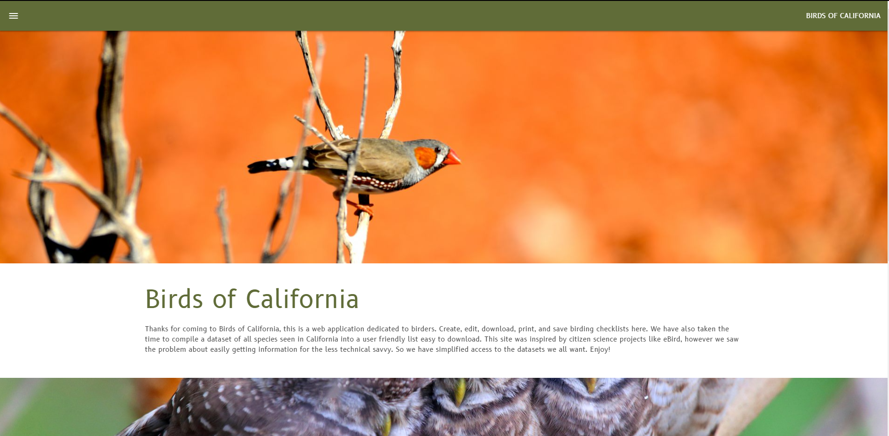
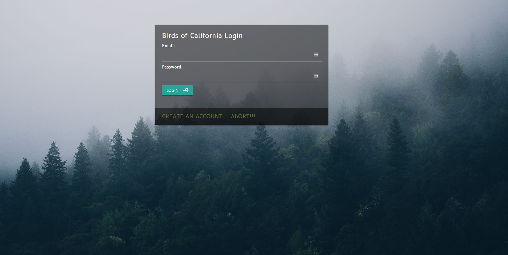
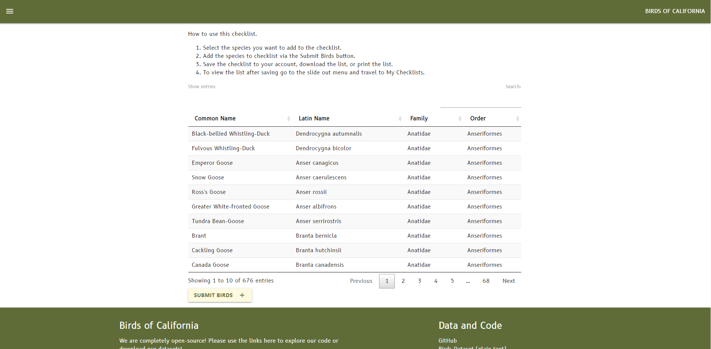
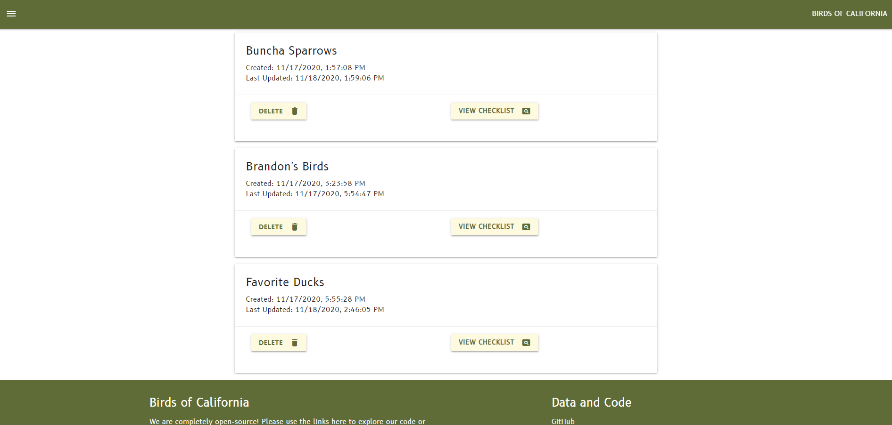
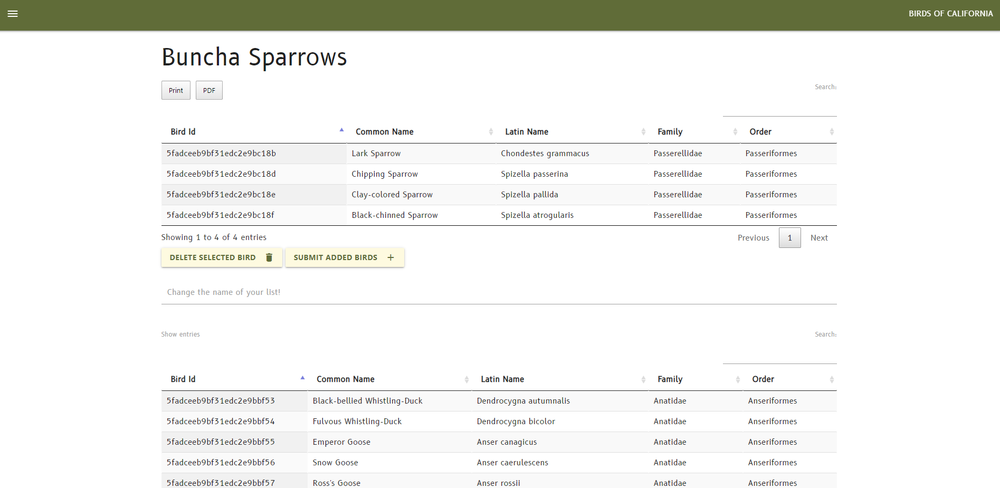
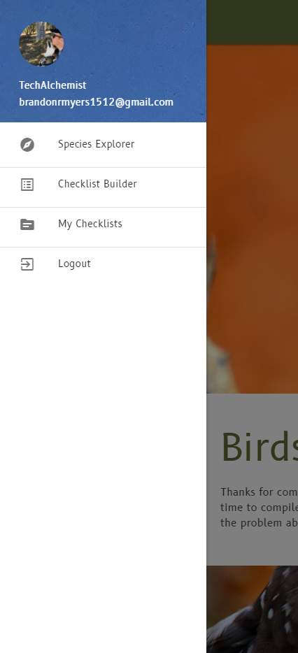

# Birds of California

## Home

## Login

## Checklist Builder

## Checklist Viewer

## Checklist Single View 

## Sidebar

---

## Technology Used
 - Node
    - Express
    - Bcrypt for Authentication
- MongoDB 
- EJS / HTML for markup and templating
- jQuery 
- Javascript
- MaterializeCSS

---

## Getting Started

1. Clone the repo to a local repo
2. NPM install package dependencies
3. Import birds-of-california-v2.csv into a MongoDB of your choice. Name your collection 'all-birds'
4. If you named your bird collection differently rename the Schema object in models. 
    - Included in screenshots is an ERD of how my data is formatted. 

--- 

## Try The Project Out Here
